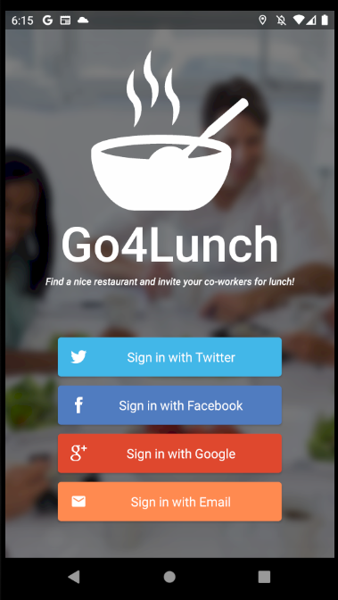
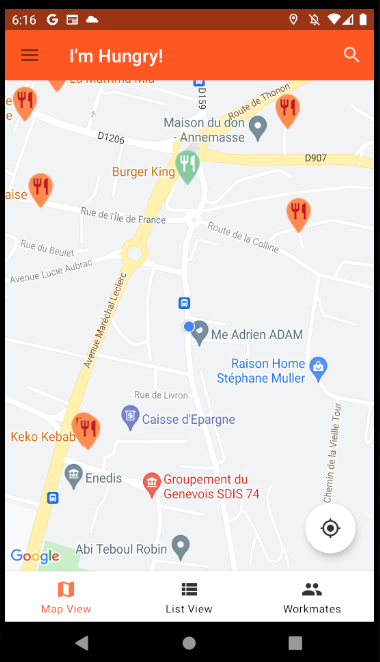
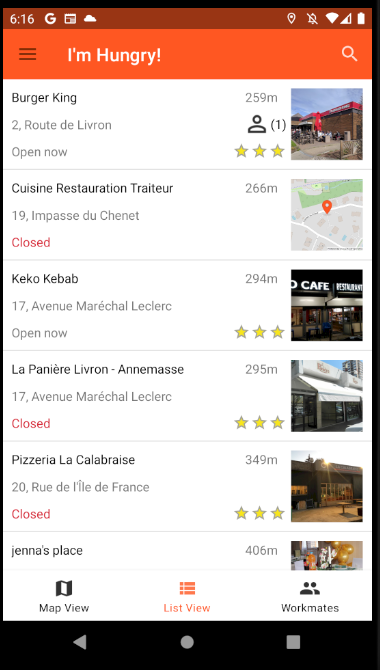
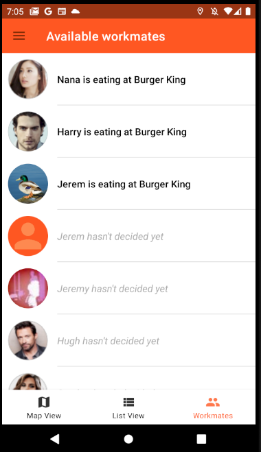
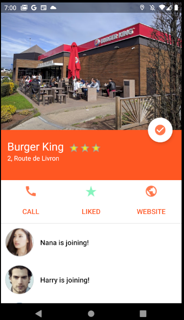
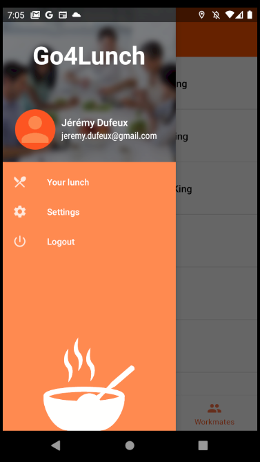

Go4Lunch is an Android app for choosing where to eat with workmates.
It allows you to search for a restaurant in the vicinity, then select it by telling your colleagues.
Likewise, it is possible to consult the restaurants selected by colleagues in order to join them.
At noon, a notification is sent to remind you of the choice of restaurant and who comes to eat with you.

***

